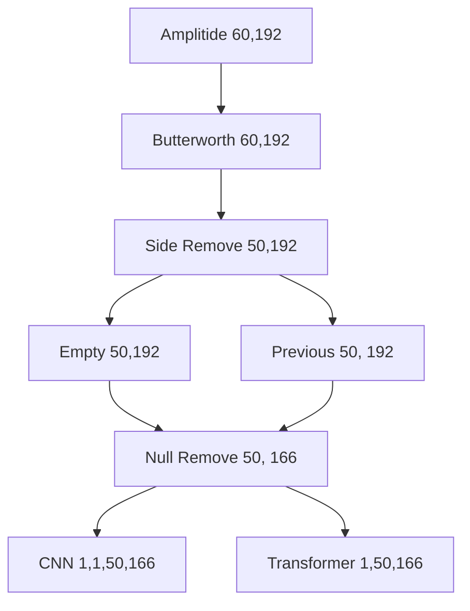

# 🛜 CSI DATA INFERENCE
1. `EDA` : 3D Visualization, Data Cleansing from Collected Data for learning Data
2. `INFERENCE` : Return Labelling results inferred by 3 Application(Action/Location/Occupancy) Model using Collected CSI data & Visualized 2D Image, Data Acuqisition
3. `Android` : CSI Modeling in Android Environment
4. `ASSETS` : Images for Github Readme. etc.
5. `CSI_2024` : Files being researched in 2024

## EDA
> it differs from Queue, Window conditions.

- **`data_dir1.py`** : This script organizes collected datasets by assigning **numbering and categorizing** them into directories (e.g., datasets/1115 → datasets/target_dir/L-sit). 
  - `-q` : merge data from a single spot (AP-L-SIT) into **one file**.  
  - `-d` : specify the directory (e.g., 1115, 1116) for classification.  

- **`data_dir2.py`** : categorizes them into directories **based on class labels**.

- **`data_dir3.py`** : **Applies a sliding window** of specified width with a given stride interval.    
- `butterworth_visualization.py` 

## Acquisition & Inference

### Acquisition Tool
<figure>
  
  <figcaption>CSI-Collecting-image-Compact</figcaption>
</figure>

- **Preprocessing** : Amplitude, Butterworth, Side Remove, Previous/Empty Prep, Null Remove
- **Neural Network** : CNN, Transformer

### Process



### How to use

```bash
conda activate csi

cd ../tools
pip install -r requirements.txt
sudo chmod 777 /dev/ttyACM0

python csi_inf_1230.py -m CNN -a -d {dir_name}
```


## Android

### Process


---
# Reference
- https://github.com/espressif/esp-csi
- https://github.com/espressif/esp-idf
- https://github.com/ultralytics/ultralytics

These codes are created **for research purposes**. 