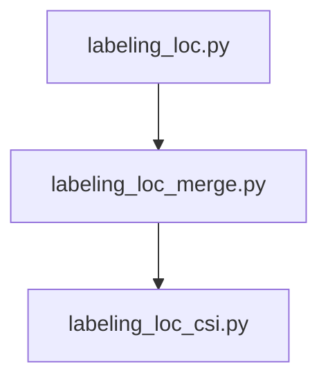

# CSI DATA INFERENCE
## Introduce 
1. `collect` : Collecting data Module for training.
2. `labeling` : CSI labeling based on images.
3. `trains` : Retruns Pre-processing and Bi-LSTM based learning Model for Sit/Stand Training
4. `inference` : Return Labelling results inferred by Sit/Stand Classify Model using Collected CSI data & Visualize Labeling through images


## Collect Module
<figure>
  
  <figcaption>CSI-Collecting-image-Compact</figcaption>
</figure>


- `FIRST_README.md`
  - A manual on the environment settings you need to build to collect data
- `csi_collect_recog.py`
  - Press the START button manually, or at a certain time, the START button is activated to collect data.
- `csi_collect_recog_auto.py`
  - When a person is automatically recognized or at a certain time, a module that collects CSI data and image data with two cameras, simultaneously deducing the number and location of people.
- `csi_collect_image_compact.py`
  - A module that collects CSI data and image data with two cameras when a person is recognized or at a specific time (Not inferenced image)
- `csi_collect_inf.py` : Infer Sit, stand without image collection (model required)

||collect csi|collect image|human detection info.(skeleton, bbox: img, csv) |passive collect|auto collection(human detection based)|
|---|:---:|:---:|:---:|:---:|:---:|
|csi_collect_recog|O|O|X|O|X|
|csi_collect_recog_auto|O|O|O|O|O|
|**csi_collect_image_compact**|O|O|X|O|O|
|csi_collect_inf|O|X|X|X|X|

### Reference
- https://github.com/espressif/esp-csi
- https://github.com/espressif/esp-idf
- https://github.com/ultralytics/ultralytics

These codes are created **for research purposes**. If you use them as an application, you can get an error. When you exit the program, you can force `Ctrl+C`.


---

## Labeling

```
├── FIRST_README.md
├── action
│   ├── labeling_action.py
│   ├── labeling_action_csi.py
│   └── labeling_action_merge.py
├── labeling_csi.py
├── location
│   ├── labeling_loc.py
│   ├── labeling_loc_csi.py
│   └── labeling_loc_merge.py
└── occupancy
    ├── labeling_occ.py
    ├── labeling_occ_csi.py
    ├── labeling_occ_merge.py
    └── labeling_people_not_use.py
```





### occupancy (Labeling based on the occupancy)
This dataset is labeled based on occupancy of person within a given N-second interval of CSI (Channel State Information) data. For example, at certain points in time, a specific label is assigned depending on **people detected.**

### action (Labeling based on the action)
This dataset is labeled according to the behaviours of people (**sit, stand, or none**) during the N-second intervals of CSI data. In other words, the CSI data corresponding to specific actions performed by a person within N seconds is labeled accordingly.

### location (Labeling based on location)
This dataset is labeled based on the location of a person within N-second intervals of CSI data. The locations are divided into specific points such as **ESP, AP, and Mid**, and each piece of data is labeled depending on whether a person is present at these locations.


- All data is labeled using a 0.1-second sliding window. This means that, for instance, if there is 1 second of data, you can extract 10 sequence data segments by sliding the window by 0.1 second each time, and additional labeling can be performed on each sequence. This approach allows for more detailed analysis.
- `/# PEOPLE` can directly label the CSI data. 
- For more details, please refer to `FIRST_README.md`.