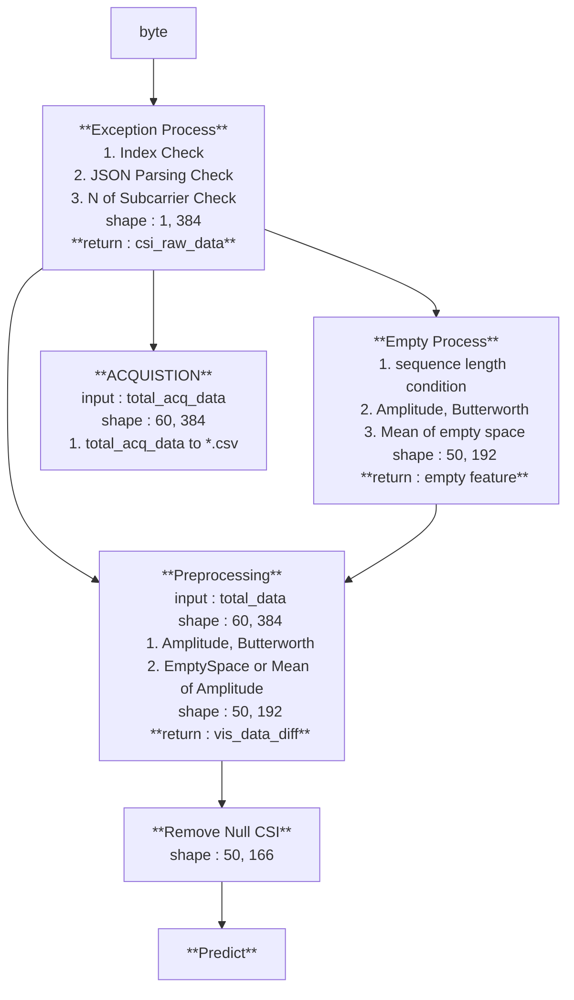

# 1. Installation Process

### Conda Env Installation

```
conda deactivate
conda activate csi
pip install -r requirements.txt 
```

### Set up build
```
cd ~/esp/esp-idf
./install.sh esp32s3
. ./export.sh
```

```
cd ~/esp/esp-csi/examples/get-started/csi_recv_router
idf.py set-target esp32s3
idf.py menuconfig
```
- `set-target esp32s3` : Make sure to set the correct chip target
- `menuconfig` : project configuration to configure Wi-Fi or Ethernet

```
sudo chmod 777 /dev/ttyACM0
# ls -al /dev/ttyACM0
```
- ESP32s3 File Permissions Settings.


### Building  and flash
```
idf.py build
idf.py flash -b 921600 -p /dev/ttyACM0
```
- build the project and flash it to the board.
- if it may be other computer's ESP, you should build and flash.


# 2. Execute Collecting Tool
```
cd ../tools
pip install -r requirements.txt
```

```
python csi_inf_1230.py 
```
### option
- `-m` : set model (”CNN” / “Transformer”)
  -  `default = CNN`
- `-a` : save `*.csv` data option (`N.csv`)
- `-d` : `*.csv` save directory
  - `default = 1230`(today, MMDD)


### Process


### if you execute, you need...
- [ ] CNN or Transformer Model `/csi/weights/{model_name}/CNN/occ`

